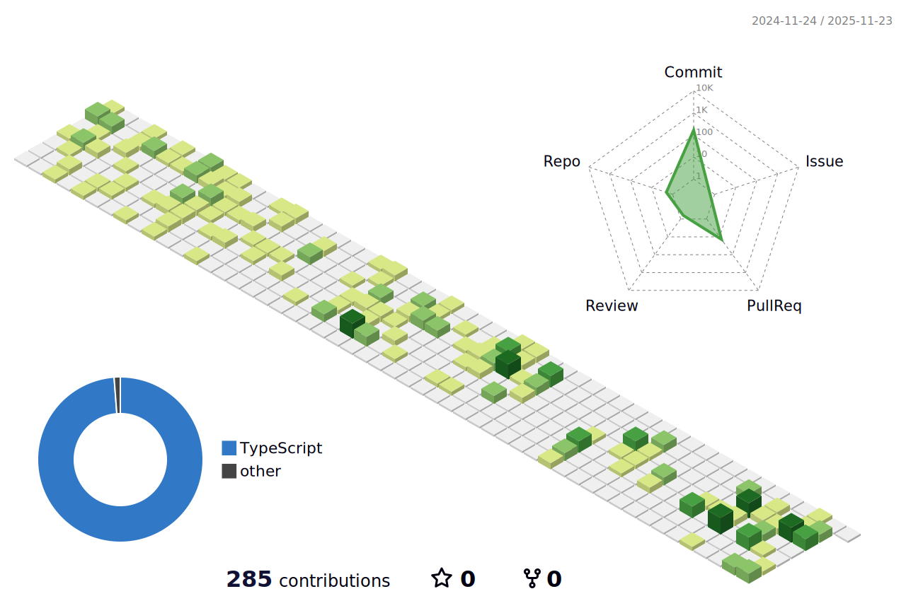

#### Moin and Welcome to my Github Page
# Hey i am Richard 👋

With a background in commonication and media sciences, i wandered through a pleathora of diciplines to end up in the beautiful struggle that is development.

My motivation is to ideate and construct applications that will baffle you, and expand my knowledge in development. 🌊

Here is my beautiful [portfolio](https://richardbeindorf.com/)  💼 👀

Also, if im not active here - find me on my **GitLab** profile.

[GitLab](https://gitlab.com/RichardBeindorf1 )  Currently working on a cinema app!

Current Skill Status:

|Skill   |Deph   |
|--------|-------|
|UI/UX / Figma|Work Experience|
|HTML    |Pro|
|CSS or Tailwind|Pro|
|JS|Expert|
|TS|Only using this actually|
|React / NextJS|Main Framework|
|ThreeJS/WebGL|Advanced|
|Angular|Fundamentals|
|NodeJS|Fundamentals|
|Express|Fundamentals|
|Redux|Fundamentals|
|MongoDB|Fundamentals|
|Prisma|Fundamentals|
|Git|Living and Breathing|

